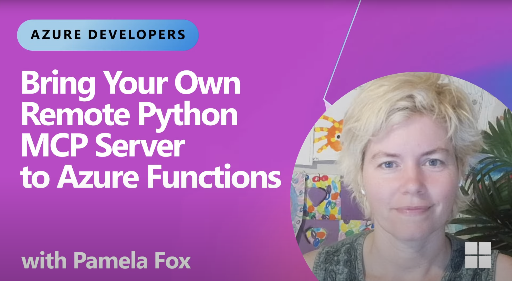

# Host remote MCP servers built with official MCP SDKs on Azure Functions (early preview)

This repo contains instructions and sample for running MCP server built with the Python MCP SDK on Azure Functions. The repo include a sample server demonstrate various MCP tools. 

You can clone to run and test the servers locally, then easily deploy with `azd up` to have them in the cloud in a few minutes.

**Watch the video overview**

<a href="https://www.youtube.com/watch?v=PAxBlQ9mFv8" target="_blank">
  
</a>

## Running MCP server as custom handler on Azure Functions

Recently Azure Functions released the [Functions MCP extension](https://techcommunity.microsoft.com/blog/appsonazureblog/build-ai-agent-tools-using-remote-mcp-with-azure-functions/4401059), allowing developers to build MCP servers using Functions programming model, which is essentially Function's event-driven framework, and host them remotely on the serverless platform.

For those who have already built servers with [Anthropic's MCP SDKs](https://github.com/modelcontextprotocol/servers?tab=readme-ov-file#model-context-protocol-servers), it's also possible to host the servers on Azure Functions by running them as _custom handlers_, which are lightweight web servers that receive events from the Functions host. They allow you to host your already-built MCP servers with no code changes and benefit from Function's bursty scale, serverless pricing model, and security features.

This repo focuses on the second hosting scenario:  

<div align="center">
  
</div>

## Prerequisites

Ensure you have the following:

* [Azure subscription](https://azure.microsoft.com/free/dotnet/) (you can create one for free)
* [Azure Developer CLI](https://learn.microsoft.com/azure/developer/azure-developer-cli/install-azd) v1.17.2 or above
* [Azure Functions Core Tools](https://learn.microsoft.com/azure/azure-functions/functions-run-local?tabs=windows%2Cisolated-process%2Cnode-v4%2Cpython-v2%2Chttp-trigger%2Ccontainer-apps&pivots=programming-language-typescript) v4.5.0 or above
* [Visual Studio Code](https://code.visualstudio.com/)
* [Azure Functions extension on Visual Studio Code](https://marketplace.visualstudio.com/items?itemName=ms-azuretools.vscode-azurefunctions)
* [uv](https://docs.astral.sh/uv/getting-started/installation/)

>[!NOTE]
>This sample requires that you have permission to create a [Microsoft Entra app](https://docs.azure.cn/entra/fundamentals/what-is-entra) in the Azure subscription you use. 

## If you already have an existing server... 

>[!IMPORTANT]
>Your server must be **stateless** and uses the **streamable-http** transport to be hosted remotely on Azure Functions today. 

The following instructions will pull in artifacts required for local server testing and deployment. The most important are: `host.json`, `local.settings.json`, and `infra`. Azure Functions only requires the first two JSON files. The `infra` directory isn't a requirement, but it's handy for provisioning and deploying the server.

It's unlikely that your project would have files and directory with the same names, but if it does, you'll need to rename them so they won't be overwritten.

Once you've done the necessary renaming, follow these steps: 
1. Inside the MCP server project, run `azd init --template self-hosted-mcp-scaffold-python`.
1. Answer the prompts
    - Continue initializing an app in '/your/mcp/project/folder'?: Select **Yes**. 
    - Files present both locally and in template: Likely the only one is README, and you can keep your existing. 
    - Enter a unique environment name: This will become the name of the resource group the server is deployed in.
1. In `host.json`:
    - Put the main Python script path as the value of `arguments`, e.g. `weather.py`
    - Ensure the `port` value is the same as the one used by the MCP server
1. Follow instructions starting in the [Test the server locally](#test-the-server-locally) section. 

You can find out more details about the [template](https://github.com/Azure-Samples/self-hosted-mcp-scaffold-python). 

## If you're starting from scratch...

Clone the repo and open the sample in Visual Studio Code

  ```shell
  git clone https://github.com/Azure-Samples/mcp-sdk-functions-hosting-python.git
  ```

## Test the server locally

1. In the root directory, run `uv run func start` to create the virtual environment, install dependencies, and start the server locally
1. Open _mcp.json_ (in the _.vscode_ directory)
1. Start the server by selecting the _Start_ button above the **local-mcp-server**
1. Click on the Copilot icon at the top to open chat (or `Ctrl+Command+I / Ctrl+Alt+I`), and then change to _Agent_ mode in the question window.
1. Click the tools icon and make sure **local-mcp-server** is checked for Copilot to use in the chat:

    
1. Once the server displays the number of tools available, ask "Return the weather in NYC using #local-mcp-server" Copilot should call one of the weather tools to help answer this question.
1. Deactivate the virtual environment

>[!NOTE]
>When the server starts locally, the Azure Functions host first pings the root (`/`) to ensure the app is up and running. Since the root isn't implemented, a 404 is returned. 
>
>Info logs coming from the MCP SDK may be written to stderr by default, which is why they appear red in Azure Functions.

## Register resource provider before deploying

Before deploying, you need to register the `Microsoft.App` resource provider:
```shell
az provider register --namespace 'Microsoft.App'
```

Wait a few seconds for registration to complete. You can check status by using:
```shell
az provider show -n Microsoft.App
```

## Deployment 

1. This sample uses Visual Studio Code as the main client. Configure it as an allowed client application:
    ```shell
    azd env set PRE_AUTHORIZED_CLIENT_IDS aebc6443-996d-45c2-90f0-388ff96faa56
    ```

1. Specify a service management reference if required by your organization. If you're not a Microsoft employee and don't know that you need to set this, you can skip this step. However, if provisioning fails with an error about a missing service management reference, you may need to revisit this step. Microsoft employees using a Microsoft tenant must provide a service management reference (your Service Tree ID). Without this, you won't be able to create the Entra app registration, and provisioning will fail.
    ```shell
    azd env set SERVICE_MANAGEMENT_REFERENCE <service-management-reference>
    ```

1. Run `azd up` in the root directory. Then pick an Azure subcription to deploy resources to and select from the available regions.

    When the deployment finishes, your terminal will display output similar to the following:

    ```shell
      (✓) Done: Resource group: rg-resource-group-name (12.061s)
      (✓) Done: App Service plan: plan-random-guid (6.748s)
      (✓) Done: Virtual Network: vnet-random-guid (8.566s)
      (✓) Done: Log Analytics workspace: log-random-guid (29.422s)
      (✓) Done: Storage account: strandomguid (34.527s)
      (✓) Done: Application Insights: appi-random-guid (8.625s)
      (✓) Done: Function App: func-mcp-random-guid (36.096s)
      (✓) Done: Private Endpoint: blob-private-endpoint (30.67s)

      Deploying services (azd deploy)
      (✓) Done: Deploying service api
      - Endpoint: https://functionapp-name.azurewebsites.net/
    ```

### Connect to server on Visual Studio Code

1. Open _mcp.json_ in the editor.
1. Stop the local server by selecting the _Stop_ button above the **local-mcp-server**.
1. Start the remote server by selecting the _Start_ button above the **remote-mcp-server**.
1. Visual Studio Code will prompt you for the Function App name. Copy it from either the terminal output or the Portal.
1. Open Copilot in Agent mode and make sure **remote-mcp-server** is checked in the tool's list.
1. VS Code should prompt you to authenticate to Microsoft. Click _Allow_, and then login into your Microsoft account (the one used to access Azure Portal).
1. Ask Copilot "Return the weather in Seattle using #remote-mcp-server". It should call one of the weather tools to help answer.

>[!TIP]
>In addition to starting an MCP server in _mcp.json_, you can see output of a server by clicking _More..._ -> _Show Output_. The output provides useful information like why a connection might've failed.
>
>You can also click the gear icon to change log levels to "Traces" to get even more details on the interactions between the client (Visual Studio Code) and the server.
>
>

## Demonstrating On-Behalf-Of (OBO) Flow

The `get_user_info` tool demonstrates how to implement the On-Behalf-Of (OBO) flow to call Microsoft Graph API on behalf of the authenticated user. This pattern is useful when your MCP tools need to access downstream services.

To test this tool, ask Copilot a question like "Use #remote-mcp-server to provide info abou the logged-in user". Copilot will ask you to provide consent to access the user's information by giving you a link. Navigate to the consent URL and grant the permissions. Then re-ask the question to Copilot. 

### How the OBO Flow Works

1. **Server Authentication**: Built-in authentication feature validates the user and forwards the bearer token in the `Authorization` header
2. **Token Extraction**: The MCP tool extracts the bearer token from the request headers
3. **Managed Identity Assertion**: A Managed Identity credential obtains an assertion token for token exchange
4. **Token Exchange**: `OnBehalfOfCredential` exchanges the bearer token for a Microsoft Graph access token
5. **API Call**: The tool calls Microsoft Graph's `/me` endpoint with the exchanged token
6. **Response**: User information is returned 

**Note**: This tool requires the infrastructure to be deployed to Azure. It will not work in local development without additional configuration.

### Redeployment

If you want to redeploy the server after making changes, run `azd deploy`. (See azd command [reference](https://learn.microsoft.com/azure/developer/azure-developer-cli/reference).)

## Built-in server authentication and authorization 

The server app is configured with the built-in server authentication and authorization feature, which implements the requirements of the [MCP authorization specification](https://modelcontextprotocol.io/specification/2025-06-18/basic/authorization#authorization-server-discovery), such as issuing 401 challenge and exposing a Protected Resource Metadata (PRM). 

In the debug output from Visual Studio Code, you see a series of requests and responses as the MCP client and server interact. When built-in MCP server authorization is used, you should see the following sequence of events:

1. The editor sends an initialization request to the MCP server.
1. The MCP server responds with an error indicating that authorization is required. The response includes a pointer to the protected resource metadata (PRM) for the application. The built-in authorization feature generates the PRM for the server app.
1. The editor fetches the PRM and uses it to identify the authorization server.
1. The editor attempts to obtain authorization server metadata (ASM) from a well-known endpoint on the authorization server.
1. Microsoft Entra ID doesn't support ASM on the well-known endpoint, so the editor falls back to using the OpenID Connect metadata endpoint to obtain the ASM. It tries to discover this using by inserting the well-known endpoint before any other path information.
1. The OpenID Connect specifications actually defined the well-known endpoint as being after path information, and that is where Microsoft Entra ID hosts it. So the editor tries again with that format.
1. The editor successfully retrieves the ASM. It then uses this information in conjunction with its own client ID to perform a login. At this point, the editor prompts you to sign in and consent to the application.
1. Assuming you successfully sign in and consent, the editor completes the login. It repeats the intialization request to the MCP server, this time including an authorization token in the request. This re-attempt isn't visible at the Debug output level, but you can see it in the Trace output level.
1. The MCP server validates the token and responds with a successful response to the initialization request. The standard MCP flow continues from this point, ultimately resulting in discovery of the MCP tool defined in this sample.

### Support for other clients

Other than Visual Studio Code, agents in Azure AI Foundry can also connect to Function-hosted MCP servers that are configured with Easy Auth. Docs coming soon. 

## Clean up resources

When you're done working with your server, you can use this command to delete the resources created on Azure and avoid incurring any further costs:

  ```shell
  azd down
  ```

## Next steps

### Find this sample in other languages

| Language (Stack) | Repo Location |
|------------------|---------------|
| C# (.NET) | [mcp-sdk-functions-hosting-dotnet](https://github.com/Azure-Samples/mcp-sdk-functions-hosting-dotnet) |
| Node | [mcp-sdk-functions-hosting-node](https://github.com/Azure-Samples/mcp-sdk-functions-hosting-node) |

## Troubleshooting 
The following are some common issues that come up. 

1. **InternalServerError: There was an unexpected InternalServerError. Please try again later.**

    Check if you have registered the `Microsoft.App` resource provider:

    ```shell
    az provider show -n Microsoft.App
    ```

    If it's showing up as unregistered, register it:
    ```shell
    az provider register --namespace 'Microsoft.App'
    ```

    Successful registration should show:
    ```shell
    Namespace      RegistrationPolicy    RegistrationState
    -------------  --------------------  -------------------
    Microsoft.App  RegistrationRequired  Registered
    ```

    Then run `azd up` again. 

2. **Error: error executing step command 'deploy --all': getting target resource: resource not found: unable to find a resource tagged with 'azd-server-name: api'. Ensure the service resource is corrected tagged in your infrastructure configuration, and rerun provision**

    This is a [known transient error](https://github.com/Azure/azure-dev/issues/5580). Try re-running `azd up`. 

3. **Ensure you have the latest version of Azure Functions Core Tools installed.**
   
    You need [version >=4.5.0](https://learn.microsoft.com/azure/azure-functions/functions-run-local?tabs=windows%2Cisolated-process%2Cnode-v4%2Cpython-v2%2Chttp-trigger%2Ccontainer-apps&pivots=programming-language-typescript). Check by running `func --version`.

4. **`.vscode/mcp.json` must be in the root for VS Code to detect MCP server registration**

    If you don't see the _Start_ button above server registrations, it's likely because `.vscode/mcp.json` isn't located in the root of your workspace folder.


