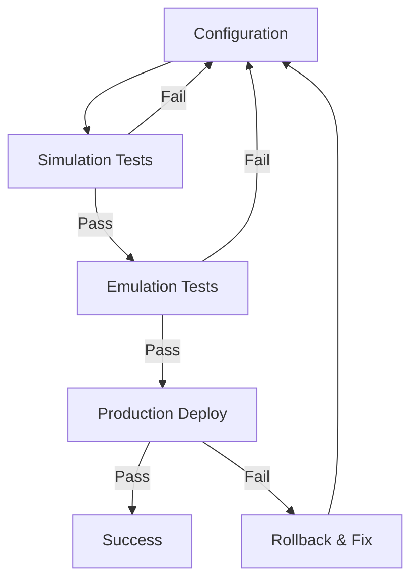

# 🎯 Proton Multi-Node Consensus Network - Experiment 02

**Multi-validator blockchain network with BFT consensus**

**Node Type:** Multi-Node Consensus Network (3+ Validators)  
**Purpose:** Production-grade blockchain network simulation with Byzantine Fault Tolerance

---

## 🚀 Quick Start

### For AI Agents & Automated Deployment
👉 **Start here:** [AGENTIC_SETUP.md](./AGENTIC_SETUP.md)

### Prerequisites Completed
✅ **Experiment 01** - Standalone block producer deployed and tested

---

## 📊 What This Experiment Provides

This builds upon experiment_01 with:

- ✅ **3+ Block Producer Nodes** - Multiple validators in consensus
- ✅ **Round-Robin Block Production** - Scheduled producer rotation
- ✅ **BFT Consensus** - Byzantine Fault Tolerant agreement protocol
- ✅ **P2P Mesh Network** - Full connectivity between all nodes
- ✅ **Fault Tolerance** - Network continues with 2/3+ validators online
- ✅ **Pre-Deployment Testing** - Simulation & emulation frameworks
- ✅ **Automated Deployment** - Multi-VM orchestration

**⚠️ Note:** Uses **Proton v2.0.5 (2020)** for consensus learning. Not for production mainnet.

---

## 🏗️ Architecture

```
┌─────────────────────────────────────────────┐
│       3-Node Consensus Network              │
│                                             │
│  Producer A  ◄──────►  Producer B          │
│  (Azure VM)             (Azure VM)          │
│      ▲                       ▲              │
│      │                       │              │
│      └────────► Producer C ◄─┘              │
│                (Azure VM)                   │
│                                             │
│  Block Schedule: A→B→C→A→B→C (round-robin) │
│  Consensus: 2/3+1 = 3 validators required  │
│  Finality: After 2/3+1 confirmations       │
└─────────────────────────────────────────────┘
```

---

## 📁 Project Structure

```
experiment_02/
├── AGENTIC_SETUP.md           ← 🎯 START HERE - Deployment guide
├── ARCHITECTURE_PLAN.md       ← Detailed architecture & design
├── README.md                  ← This file (overview)
├── .env.template              ← Multi-node configuration template
├── deploy-multi-node.sh       ← Automated deployment script
├── simulation/                ← Pre-deployment validation
│   ├── README.md              ← Simulation framework guide
│   ├── run_all_tests.sh       ← Execute all simulation tests
│   ├── test_key_generation.sh
│   ├── test_genesis_validation.sh
│   ├── test_producer_schedule.sh
│   ├── test_network_connectivity.sh
│   ├── test_consensus_rules.sh
│   └── test_configuration_files.sh
├── emulation/                 ← Local Docker testing
│   ├── README.md              ← Emulation framework guide
│   ├── docker-compose-emulation.yml
│   ├── start_local_network.sh
│   ├── run_emulation_tests.sh
│   ├── emulate_normal_operation.sh
│   ├── emulate_node_failure.sh
│   ├── emulate_majority_failure.sh
│   └── emulate_network_partition.sh
└── tests/                     ← Post-deployment validation
    ├── validate_production.sh
    ├── validate_consensus.sh
    └── validate_p2p.sh
```

---

## ⚡ Deployment Pipeline

Follow this **3-phase testing approach** to prevent errors:

### Phase 1: Simulation (2 minutes)
```bash
cd simulation/
./run_all_tests.sh
```

**Tests configuration without deploying anything:**
- ✅ Key generation uniqueness
- ✅ Genesis validation
- ✅ Producer schedule logic
- ✅ Network connectivity matrix
- ✅ Consensus rules (2/3+1)

### Phase 2: Emulation (10 minutes)
```bash
cd emulation/
./run_emulation_tests.sh
```

**Tests full network locally in Docker:**
- ✅ Normal multi-node operation
- ✅ Single node failure (2/3 online)
- ✅ Majority failure (<2/3 online)
- ✅ Network partition & recovery

### Phase 3: Production Deployment
```bash
# Configure environment
cp .env.template .env
nano .env  # Add your Azure details

# Deploy to Azure
./deploy-multi-node.sh

# Validate
./tests/validate_production.sh
```

**Deploys 3 Azure VMs with consensus network**

---

## 🔑 Key Differences from Experiment 01

| Feature | Experiment 01 | Experiment 02 |
|---------|---------------|---------------|
| **Architecture** | Single node | Multi-node network |
| **Validators** | 1 producer | 3+ producers |
| **Consensus** | None | BFT (2/3+1) |
| **P2P Network** | No peers | Full mesh |
| **Production** | Continuous | Round-robin |
| **Fault Tolerance** | N/A | Survives 1/3 node failures |
| **Testing** | Basic | Simulation + Emulation |
| **Complexity** | Low | Medium-High |
| **Use Case** | Local dev | Multi-validator simulation |

---

## 🧪 Testing Philosophy

**Never deploy untested configurations to Azure**



**Required Success Rates:**
- Simulation: 100% (6/6 tests pass)
- Emulation: 100% (4/4 tests pass)
- Production: All validators producing blocks

---

## 📖 Documentation

### For Deployment
- [AGENTIC_SETUP.md](./AGENTIC_SETUP.md) - Step-by-step deployment guide
- [ARCHITECTURE_PLAN.md](./ARCHITECTURE_PLAN.md) - Design decisions & architecture
- [.env.template](./.env.template) - Configuration reference

### For Testing
- [simulation/README.md](./simulation/README.md) - Simulation framework
- [emulation/README.md](./emulation/README.md) - Emulation framework
- [tests/README.md](./tests/README.md) - Production validation

---

## 🎓 Learning Objectives

This experiment teaches:

1. **Multi-Node Consensus** - How validators agree on blockchain state
2. **BFT Mechanisms** - Byzantine Fault Tolerance in practice
3. **P2P Networking** - Peer-to-peer blockchain communication
4. **Round-Robin Scheduling** - Block producer rotation
5. **Fault Tolerance** - Network resilience to failures
6. **Testing Methodologies** - Simulation, emulation, dry-run, production

---

## 🚦 Status

| Component | Status | Progress |
|-----------|--------|----------|
| **Architecture Planning** | ✅ Complete | 100% |
| **Simulation Framework** | ✅ Complete | 100% |
| **Emulation Framework** | ✅ Complete | 100% |
| **Deployment Scripts** | 🔄 In Progress | 60% |
| **Testing Suite** | 🔄 In Progress | 40% |
| **Documentation** | ✅ Complete | 100% |

---

## 🔗 Dependencies

### From Experiment 01
- ✅ Docker deployment pattern
- ✅ Azure VM provisioning
- ✅ Proton v2.0.5 knowledge
- ✅ Key generation process
- ✅ Genesis configuration

### New Skills Required
- Multi-VM orchestration
- P2P network configuration
- Consensus mechanism understanding
- Parallel deployment coordination

---

## 📚 References

- **Experiment 01:** `/workspaces/XPR/proton-node/agentic_dev/experiment_01/`
- **EOSIO Consensus:** https://developers.eos.io/welcome/v2.1/protocol/consensus_protocol
- **DPoS-BFT:** https://medium.com/eosio/dpos-bft-pipelined-byzantine-fault-tolerance-8a0634a270ba
- **Proton Core:** https://github.com/XPRNetwork/core

---

## 🎯 Success Criteria

Network is production-ready when:

- ✅ All simulation tests pass (6/6)
- ✅ All emulation tests pass (4/4)
- ✅ 3 VMs deployed to Azure
- ✅ All producers generating blocks
- ✅ Round-robin rotation verified
- ✅ 2/3+1 consensus achieved (LIB progressing)
- ✅ P2P mesh fully connected (each node sees 2 peers)
- ✅ Network survives single node failure
- ✅ No chain forks (single canonical blockchain)

---

**Next Step:** [AGENTIC_SETUP.md](./AGENTIC_SETUP.md) - Begin deployment process
