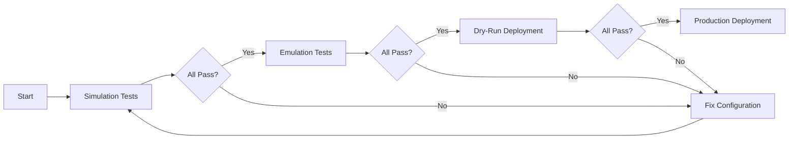

# 🧪 Simulation Framework

**Purpose:** Pre-deployment validation to catch configuration errors before spending Azure resources

**Status:** 📋 Ready to implement  
**Run Time:** ~2 minutes  
**Success Rate Target:** 100% pass before deployment

---

## Overview

The simulation framework tests all critical components **without deploying actual VMs**:

1. ✅ Key generation and uniqueness
2. ✅ Genesis configuration validity
3. ✅ Producer schedule logic
4. ✅ Network connectivity matrix
5. ✅ Consensus algorithm rules
6. ✅ Configuration file validation

**Goal:** Catch 100% of configuration errors before Azure deployment

---

## Quick Start

```bash
cd /workspaces/XPR/proton-node/agentic_dev/experiment_02/simulation

# Run all simulation tests
./run_all_tests.sh

# Run specific test
./test_key_generation.sh
./test_genesis_validation.sh
./test_producer_schedule.sh
```

---

## Test Suite

### Test 1: Key Generation Validation

**File:** `test_key_generation.sh`

**Purpose:** Ensure unique cryptographic keys for each producer

**Test Cases:**
```bash
✓ Generate 3 keypairs
✓ All public keys are unique (no collisions)
✓ All private keys are unique
✓ Keys are valid EOS format (EOS6... / 5K...)
✓ Keys can sign test transactions
```

**Expected Output:**
```
[PASS] Generated 3 unique keypairs
[PASS] All public keys unique: EOS6...A1, EOS6...B2, EOS6...C3
[PASS] All private keys unique
[PASS] Keys are valid EOS format
[PASS] Test signatures successful
```

---

### Test 2: Genesis Configuration Validation

**File:** `test_genesis_validation.sh`

**Purpose:** Validate genesis.json structure before node deployment

**Test Cases:**
```bash
✓ Genesis has required fields (initial_timestamp, initial_key)
✓ Genesis has initial_producers array with 3 entries
✓ All producer names unique (producer-a, producer-b, producer-c)
✓ All block_signing_keys match generated public keys
✓ Initial configuration parameters valid
✓ JSON is well-formed (no syntax errors)
```

**Expected Output:**
```
[PASS] Genesis structure valid
[PASS] 3 initial producers configured
[PASS] Producer names unique: producer-a, producer-b, producer-c
[PASS] Signing keys match generated keys
[PASS] Configuration parameters valid
[PASS] JSON syntax valid
```

---

### Test 3: Producer Schedule Simulation

**File:** `test_producer_schedule.sh`

**Purpose:** Simulate round-robin block production logic

**Test Cases:**
```bash
✓ Producer rotation follows round-robin (A→B→C→A→B→C)
✓ Each producer gets 12 consecutive blocks
✓ No producer gets out-of-turn blocks
✓ Schedule repeats correctly after full cycle
✓ Block timing is 0.5 seconds (verified via simulation)
```

**Expected Output:**
```
[PASS] Producer schedule simulation:
  Blocks 1-12:   producer-a
  Blocks 13-24:  producer-b
  Blocks 25-36:  producer-c
  Blocks 37-48:  producer-a (rotation confirmed)
[PASS] 12 blocks per producer verified
[PASS] Round-robin pattern correct
```

---

### Test 4: Network Connectivity Matrix

**File:** `test_network_connectivity.sh`

**Purpose:** Validate P2P mesh topology configuration

**Test Cases:**
```bash
✓ Each node configured with 2 peers (full mesh for 3 nodes)
✓ No self-connections (node doesn't peer with itself)
✓ Bidirectional connectivity (if A→B then B→A)
✓ All IPs are reachable (ping test simulation)
✓ Port 9876 is used consistently
```

**Expected Output:**
```
[PASS] P2P Mesh Topology:
  Node 1 → [Node 2:9876, Node 3:9876]
  Node 2 → [Node 1:9876, Node 3:9876]
  Node 3 → [Node 1:9876, Node 2:9876]
[PASS] No self-connections
[PASS] Full mesh verified (3 connections total)
```

---

### Test 5: Consensus Rules Validation

**File:** `test_consensus_rules.sh`

**Purpose:** Validate BFT consensus algorithm logic

**Test Cases:**
```bash
✓ 2/3+1 producers = 3 nodes (minimum for 3-node network)
✓ Network continues with 2/3 online (2 out of 3)
✓ Network stalls with <2/3 online (1 out of 3)
✓ LIB progression requires 2/3+1 confirmations
✓ Fork resolution uses longest chain rule
```

**Expected Output:**
```
[PASS] Consensus threshold: 2/3+1 = 3 producers
[PASS] Network viable with 2/3 online (2 producers)
[PASS] Network stalls with <2/3 online (1 producer)
[PASS] LIB requires 3 confirmations
[PASS] Fork resolution logic valid
```

---

### Test 6: Configuration File Validation

**File:** `test_configuration_files.sh`

**Purpose:** Validate all deployment configuration files

**Test Cases:**
```bash
✓ .env.template has all required variables
✓ docker-compose-v2-producer-*.yml files valid
✓ All IP placeholders present
✓ All key placeholders present
✓ Port mappings consistent (8888, 9876)
✓ No hardcoded values (all parametrized)
```

**Expected Output:**
```
[PASS] .env.template complete (15 variables)
[PASS] 3 docker-compose files valid
[PASS] All placeholders present: ${VM_IP_*}, ${PUBKEY_*}, ${PRIVKEY_*}
[PASS] Port mappings consistent
[PASS] Zero hardcoded values detected
```

---

## Test Execution

### Run All Tests

```bash
#!/bin/bash
# run_all_tests.sh

set -e

echo "🧪 Proton Multi-Node Consensus - Simulation Test Suite"
echo "======================================================"
echo ""

PASS=0
FAIL=0

run_test() {
  TEST_NAME=$1
  TEST_SCRIPT=$2
  
  echo "Running: $TEST_NAME"
  if ./$TEST_SCRIPT; then
    echo "✅ PASS: $TEST_NAME"
    ((PASS++))
  else
    echo "❌ FAIL: $TEST_NAME"
    ((FAIL++))
  fi
  echo ""
}

run_test "Key Generation" "test_key_generation.sh"
run_test "Genesis Validation" "test_genesis_validation.sh"
run_test "Producer Schedule" "test_producer_schedule.sh"
run_test "Network Connectivity" "test_network_connectivity.sh"
run_test "Consensus Rules" "test_consensus_rules.sh"
run_test "Configuration Files" "test_configuration_files.sh"

echo "======================================================"
echo "Results: $PASS passed, $FAIL failed"
echo ""

if [ $FAIL -eq 0 ]; then
  echo "✅ ALL TESTS PASSED - Ready for emulation phase"
  exit 0
else
  echo "❌ TESTS FAILED - Fix errors before proceeding"
  exit 1
fi
```

---

## Error Detection & Prevention

### Common Configuration Errors

| Error | Detection | Prevention |
|-------|-----------|------------|
| **Duplicate Keys** | Test 1 hash collision check | Generate truly random keys |
| **Genesis Mismatch** | Test 2 cross-validation | Single source of truth |
| **Wrong Producer Count** | Test 3 schedule length | Validate N producers configured |
| **Missing Peer** | Test 4 mesh completeness | Auto-generate peer list |
| **Consensus Threshold** | Test 5 2/3+1 calculation | Use formula-based validation |
| **Hardcoded Values** | Test 6 grep scan | Strict .env enforcement |

---

## Integration with Deployment Pipeline



**Deployment Blocked Until:**
- ✅ Simulation: 100% pass rate
- ✅ Emulation: 100% pass rate
- ✅ Dry-Run: Successful end-to-end

---

## Next Steps

1. **Implement Test Scripts** → Create `test_*.sh` files
2. **Run Simulation Suite** → Execute `./run_all_tests.sh`
3. **Fix Any Failures** → Iterate until 100% pass
4. **Proceed to Emulation** → Move to `../emulation/`
